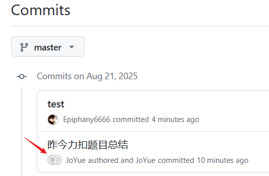

# 问题描述

有些用户在使用 Git 向 GitHub 提交代码时，会遇到一个常见的问题，即提交记录中显示的作者名称为未知作者。这样不仅会导致提交历史不够清晰，也无法正确地追溯代码贡献者。同时，这也会给协作开发和版本控制带来一定的困扰。



---

# 问题原因

导致 GitHub 提交显示为未知作者的原因可能有多种情况。以下是一些常见的问题原因及解决方法：

## 1、未正确配置全局用户信息

当我们在 [Git](https://deepinout.com/git/git-top-tutorials/1696390559_j_git.html) 中使用 `git config` 命令设置用户名与邮箱时，Git 会将这些信息与每一次提交记录一同保存在本地的 `.git` 目录中。这样，GitHub 在展示提交记录时，可以根据用户信息正确显示作者。

解决方法：
可以通过以下两个 Git 命令来配置全局的用户名和邮箱：

```bash
$ git config --global user.name "Your Name"
$ git config --global user.email "your_email@example.com"
```

在这里，将 `Your Name` 替换为你的真实名字，`your_email@example.com` 替换为你注册 GitHub 帐号时使用的电子邮件地址。

---

## 2、使用不同的邮箱地址提交

如果你在 Git 配置中设置的邮箱与你在 GitHub 上使用的邮箱地址不一致，那么提交记录中的作者信息将无法正确显示。

解决方法：
可以通过以下命令来为当前 Git 仓库单独设置邮箱地址：

```bash
$ git config user.email "your_email@example.com"
```

同样地，将 `your_email@example.com` 替换为你在 GitHub 上使用的电子邮件地址。